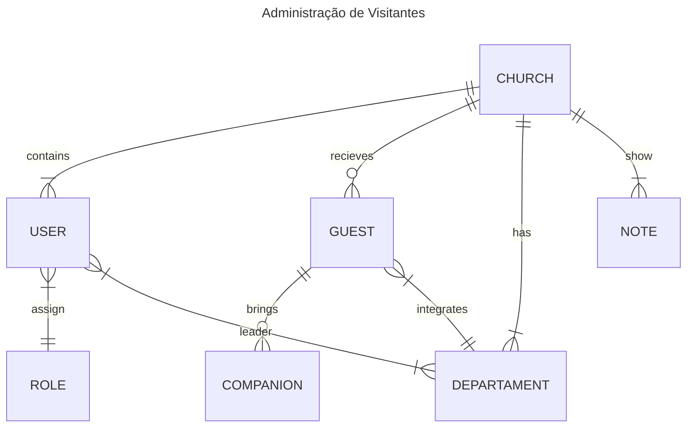
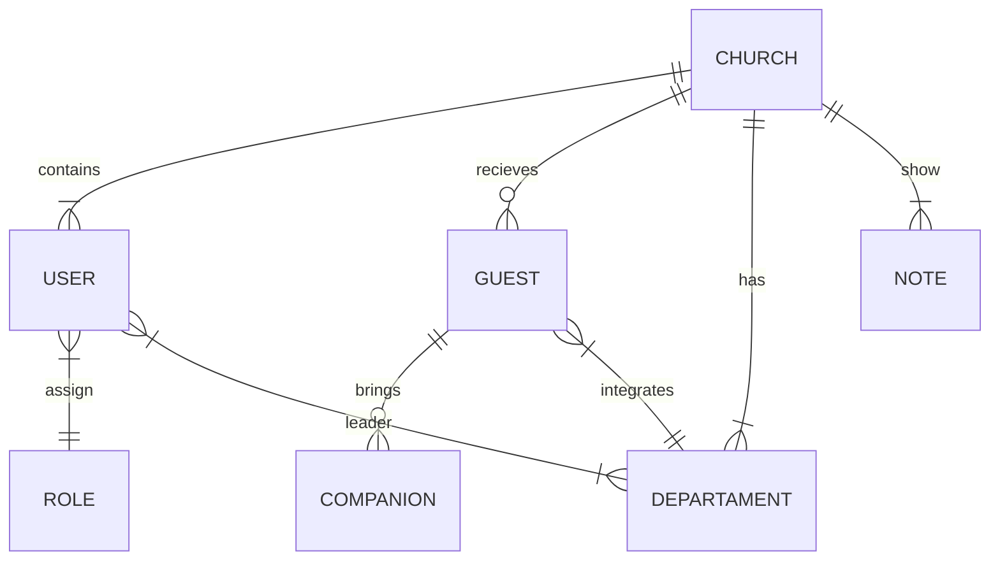

# SIGI

Este repositório tem como finalidade explicar de forma objetiva quais as funcionalidaes presentes no SIGI (Sistema de Gerênciamento de Igrejas)

### Diagrama ER

---

## title: Administração de Visitantes

