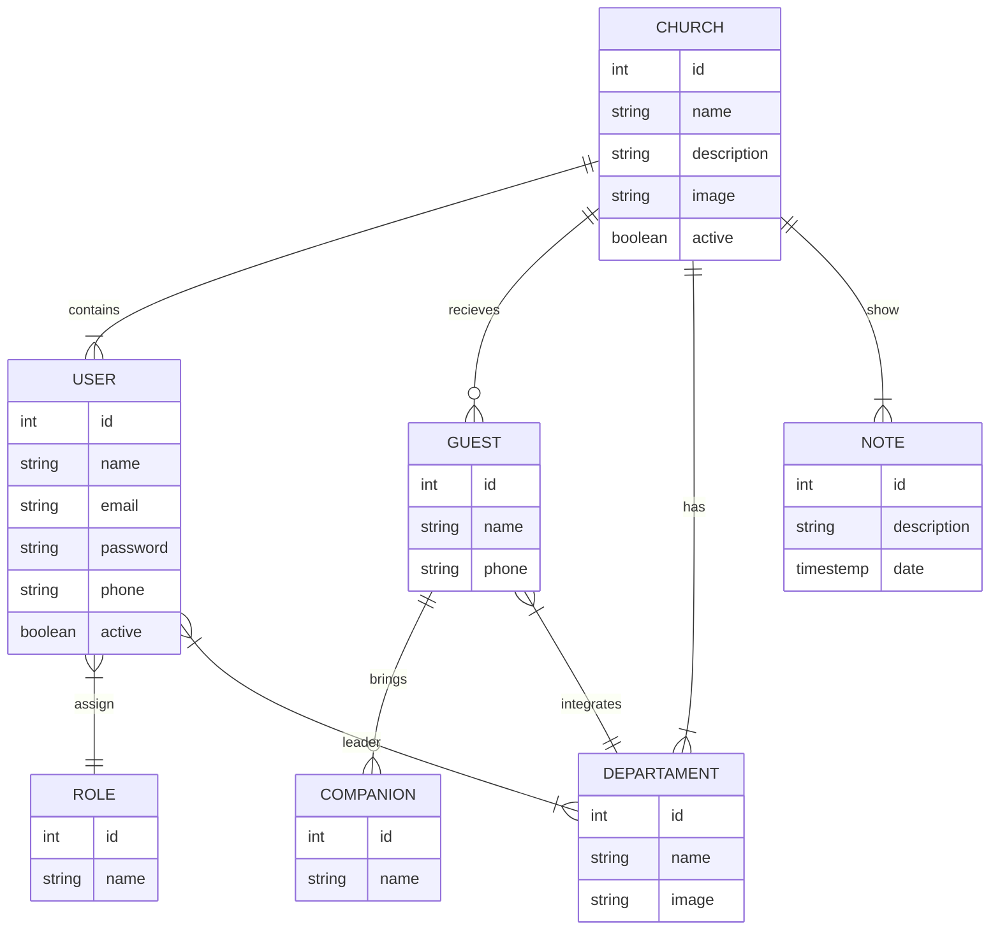

## Backend

### Diagrma de tabelas



### Admin

#### Criar igreja

O usuário admin será o único tipo de usuário que será permitido a funcionalidade de criar uma nova igreja.
Para cirar uma igreja também será necessario criar um usuário gestor para igreja contendo apenas o email deste usuário.
Todas as igrejas criadas devem ser criadas com o status `active = flase`

Request:
`POST /churchs`

```ts
interface CreateChurch {
  name: string;
  description: string;
  oynerEmail: string;
}
```

#### Ativar/Desativar igreja

O usuário admin pode ativar ou desativar qualquer igreja do sistema
Ao ativar uma igreja pela primeira vez, deve-se enviar o email de reset de senha para o email do usuário gestor

Request
`PATCH churchs/:id/toggle-active`

#### Reenvidar email de reset de senha

O usuário admin pode solicitar o envio do email de reset de senha para qualquer usuário do sistema

Request
`POST users/:id/notify-reset-password`

#### Atualizar dados do usuário gestor

O usuário admin pode atulizar dados do usuário gestor de uma igreja

Request
`PUT /users/:id`

```ts
interface UpdateUser {
  name: string;
  email: string;
  phone: string;
  active: bollean;
}
```

### Gestor

#### Atualizar dados da igreja

O usuário gestor pode atualizar dados da igreja a qual ele esta associado

Request
`PATCH /churchs/:id`

```ts
interface UpdateChurch {
  name: string;
  description: string;
}
```

#### Atualizar imagem da igreja

O usuário gestor pode atualizar a imagem da igreja

Request
`POST /churchs/:id/image`

```ts
interface UpdateChurchImage {
  image: FILE;
}
```

#### Adicionar um usuário

O usuário gestor pode adicionar um novo usário à igreja que esta associado
Quando o usuário for criado, deve-se enviar o email de boas vindas para que o usuário possa colocar sua senha

Request
`POST /users`

Request

```ts
interface CreateUser {
  name: string;
  email: string;
  phone?: string;
  roleId: number;
}
```
